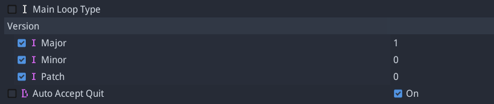

# Godot Version

Version management for Godot projects

#### What?

This is a plugin that can be added to your Godot **2.1** projects that allows for simple version management for tracking and update notification purposes. It has **NOT been tested with Godot 3.0**, though AFAIK it should still be compatible.

#### Why?

We wanted a clean and reusable way to maintain a regular version code in our games that does not rely on external build processes or platform build codes. This makes it easier to track builds both in development and production as well as easily query and display the current version in game.

----

## What it actually does

In the simplest form it adds a `version/` parameter to your project settings



A `version` object is also globally accessible (automatic `autoload`) to perform runtime queries, which provides a single function `get_version()`, also accessible as `version` property, with all version info:

```gdscript
var version_info = version.get_version()
# will result in
version_info = {
    'major': 1,
    'minor': 0,
    'patch': 0,
    'os': 'ios',                    # 3 letter truncated OS string
    'engine': '2.1.4',              # running Godot version
    'debug': false,
    'string': 'v1.0.0.ios/2.1.4',   # full version string
    'short': '1.0.0'                # shortened version string
}
```

### Helper nodes

A few extra node types are included for extra functionality if desired

####  `VersionLabel`

Exactly what it says. A `Label` extension that will automatically display the current version - either *full version* or *short version*. It will also change color depending on version update checking (see below). These colors are also configurable.

####  `VersionChecker`

This is a node that can be added to check the latest release version against the current running version... yes, checking for updates.  This is currently only implemented for **iOS** and **Android** and relies on the Apple/Google listing to query the latest published version. It is intended to notify the user if an update is found and remind them to stay up to date.

> In order for the `VersionChecker` to work you must add SSL certificates to your project.
See [this tutorial](http://docs.godotengine.org/en/stable/learning/features/networking/ssl_certificates.html) and [this link](https://www.reddit.com/r/godot/comments/61qknr/getting_certificate_for_ssl_verification/) for help with certs

#### Usage

Call the `check_update()` function to check for version updates. This will occur when the node is ready if `auto_check` == **true** (default). The iOS App ID or Android Bundle ID must be set correctly for the check to work for each respective platform.

`VersionChecker` emits 2 signals:

- `update_found(latest_version, current_version, severity, update_url)`
- `error(error, http_code, parse_error)`

##### Android
Don't forget to add the **Internet** permission for Android builds or the `VersionChecker` will fail

## Known issues

1. Version changes will not reflect on any `VersionLabel` **in the editor** until the project is reopened

2. In order for the `VersionChecker` to work for a given platform a published version must already exist. This means for the first version, requests will always fail in development - and the `error` signal will be emitted. It **WILL** work once published, though the first version should be up to date and nothing will happen - with no errors.
> For testing purposes, you can use any valid App ID or Bundle ID and play with the version number - just find a published app, such as one you have already published, and use that ID in the `VersionChecker`. Make sure you change these to the correct ID's before release.

----

Copyright © 2017 Ryan Mastrolia

Licensed under The MIT License (MIT)
